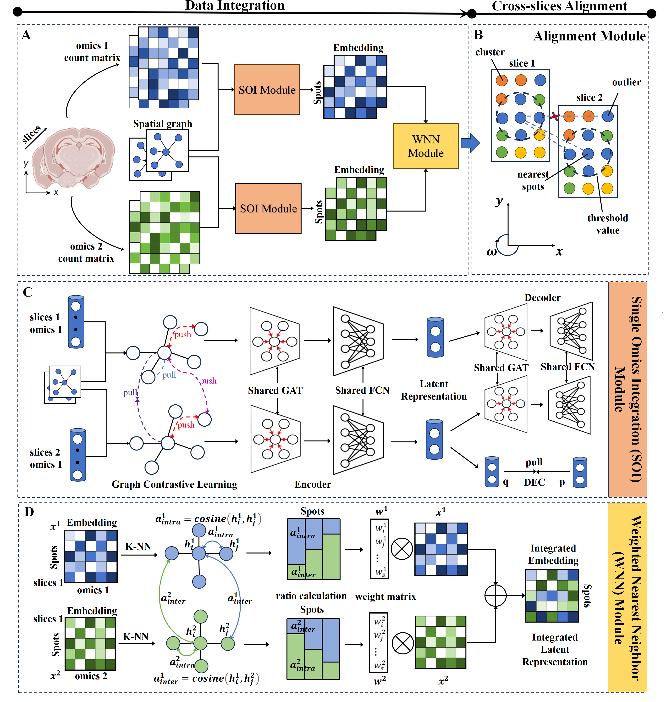

# SPAIR
SPAIR: Spatial Multi-omics Integration and Alignment via Pairwise Contrastive Learning

## Overview
SPAIR is a computational framework designed for multi-batch spatial multi-omics integration, enabling unified spatial domain identification, 3D tissue reconstruction, and cross-omics inference. As illustrated in Figure_A, the pipeline begins by processing preprocessed molecular data and spatial graphs through the SOI Module to extract modality-specific embeddings. These embeddings are fused via the WNN module to produce an integrated multi-omics representation for downstream tasks, including spatial domain identification and cross-slice alignment (Figure_B).
The SOI Module (Figure_C) employs graph attention networks to capture local microenvironment features, integrating both inner-batch and cross-batch contrastive learning. Feature reconstruction, adjacency reconstruction, and domain distribution tuning further refine the embeddings. The WNN module (Figure_D) adaptively integrates heterogeneous modal embeddings by computing cross-modality affinity ratios and applying weighted fusion. Finally, for spatial registration across slices, SPAIR uses a TrICP alignment strategy (Figure_E) that excludes outlier correspondences to improve both accuracy and robustness.
In summary, SPAIR provides a flexible and efficient framework for mosaic integration of multi-batch spatial multi-omics data. It supports core downstream analyses—including multi-modal integration, local and global slice alignment, 3D tissue reconstruction, and cross-omics prediction—offering a robust computational tool for in-depth exploration of spatial biological mechanisms.
## Software dependencies
scanpy==1.9.3  
squidpy==1.3.0  
pytorch==1.13.0(cuda==11.6)   
torch_geometric==2.3.1(cuda==11.6)  
R==3.5.1  
mclust==5.4.10
## Set up
First clone the repository. 
```
git clone https://github.com/Zhenpm/SpatialMOSI.git 
cd SPAIR-main
```
Then, we suggest creating a new environment： <br />
```
conda create -n SPAIR python=3.9
conda activate SPAIR
```
Additionally, install the packages required: <br />
```
pip install -r requiements.txt
``` 
## Datasets

We employed five distinct spatial omics datasets to evaluate model performance:

### 1. Simulated Data

### 2. MISAR-seq mouse embryonic development Data

### 3. Mouse Brain Spatial ATAC-RNA-seq Data

### 4. DLPFC Data

### 5. SPOTS mouse spleen RNA-protein Data

Five datasets can be downloaded from https://pan.baidu.com/
